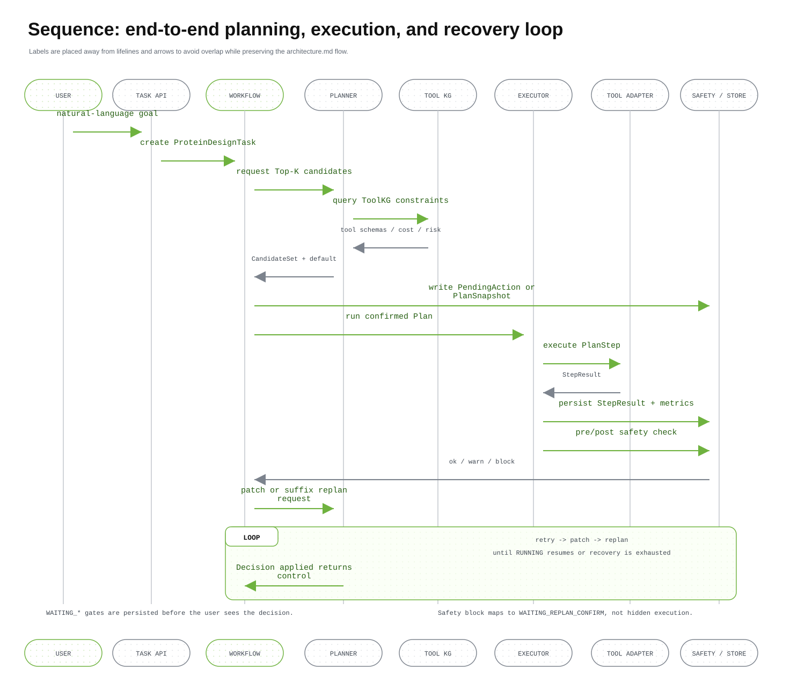
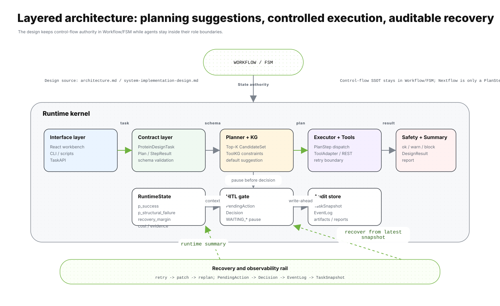
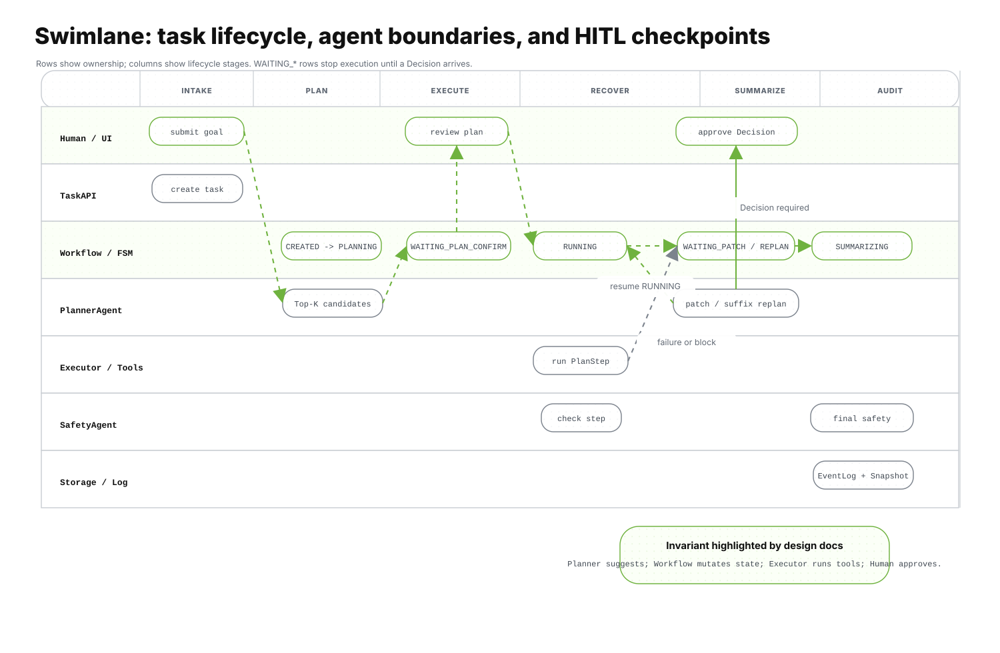
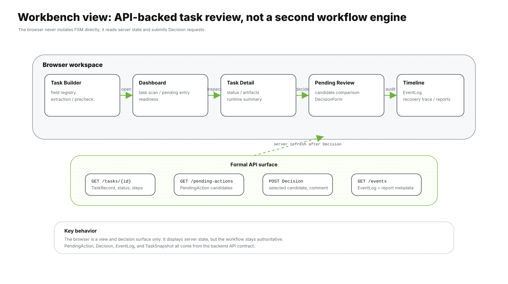

# thesis-project.dev

> `dev` 分支工作树，面向日常开发、集成验证与阶段候选产物冻结。
>
> 稳定主线在 `../thesis-project.master/`，设计主线在 `../thesis-project.design/`。

面向蛋白质设计任务的 **LLM 驱动多智能体工作流系统**。

本仓库的 `master` 分支定位为稳定主线和对外入口。当前 `master`
已经合入 CEBRA-WP v2 阶段成果，阶段标签为 `cebra-wp-v2-stage-20260506`。
当前代码基线包含核心算法实现、Task Intake、React 工作台、runtime schema、
分层 patch/replan 恢复、实验矩阵和审计可视化。算法机制已经在代码中明确落地；
算法有效性仍需要后续实验、消融和指标评估验证。

## 1. 项目定位

`thesis-project` 是一个面向蛋白质设计任务的 **LLM 驱动多智能体工作流系统**。系统不把 LLM 只作为文本生成器，而是将其纳入可执行、可恢复、可审计的科研工作流控制层。

当前开发主线的目标是：

- 根据自然语言或结构化任务输入生成可执行 `Plan`；
- 在运行中维护显式 FSM 状态，并严格记录状态迁移；
- 对高代价、长链路、易失败的蛋白设计流程进行 runtime-aware 控制；
- 在失败时按 `retry -> patch -> replan` 顺序恢复；
- 在关键节点通过 HITL 暂停、展示候选、等待人工决策；
- 将计划、执行、候选、决策、快照和事件日志串成可复现证据链。

不可绕过的系统约束入口：

- `AGENT_CONTRACT.md`：FSM、agent 边界、恢复顺序、状态持久化等系统不变量；
- `AGENTS.md`：本仓库内 Codex/实现助手的操作约束；
- `../thesis-project.design/docs/design/`：算法、架构、HITL、运行时控制的权威设计文档。

## 2. 当前核心算法

新算法将问题定义为：

> 在高代价、长链路、可失败、可恢复的蛋白质设计工作流中，动态生成、评估、裁剪并修正工具链，使系统以更低成本获得更高任务成功率。

形式化输入包括设计目标、约束集合、ToolKG、当前执行上下文和运行时观测；形式化输出包括候选工具链、默认推荐、局部 patch、后缀 replan 或 stop 建议。

### 2.1 候选生成与评分

Planner 不只输出单一路径，而是在关键节点生成候选集合：

- `PlanCandidate`：初始工作流候选；
- `PatchCandidate`：局部修复候选；
- `ReplanCandidate`：后缀重规划或终止建议候选。

候选评分分为静态评分和运行时重排序：

- 静态评分关注可行性、目标匹配、成本、风险、恢复复杂度与稳定性；
- 运行时重排序使用 `final_score = clip(static_score + runtime_adjustment, 0, 1)`；
- runtime 项只作用于已通过 schema / I-O / tool availability 校验的候选，不能覆盖硬约束违规。

### 2.2 Lite Belief-State

运行时状态采用轻量 belief-state，只持久化动作选择真正需要的五个核心量：

- `p_success`：继续当前链路最终成功的估计概率；
- `p_structural_failure`：结构性失败或后续必然升级的估计概率；
- `recovery_margin`：不丢失有效前缀的恢复余量；
- `expected_remaining_cost`：从当前时刻到终止的剩余成本暴露；
- `evidence_sufficiency`：是否已有足够证据支持继续进入更昂贵步骤。

`budget_pressure`、`intervention_value`、`local_patchability`、`prefix_preservability` 等作为派生量进入审计字段和动作解释，不作为长期主状态。

### 2.3 动作选择

CEBRA-WP v2 的算法对象已按版本归档：

- `static_score.v1`：静态候选效用与 `score_breakdown`；
- `posterior_score.v1` / `posterior_objective.v1`：证据加权目标评分；
- `runtime_adjustment.v1`：基于 runtime state 的候选重排序；
- `action_utility.v1` / `action_features.v1`：恢复动作效用；
- `action_bias.v1`：runtime delta 的动作偏置解释层。

动作选择的稳定语义是服务于恢复闭环，而不是替代恢复闭环。第一版动作空间包括：

- `continue`：证据充分且风险可控时继续当前链路；
- `patch_local`：局部错误可修复时保留成功前缀并生成最小 patch；
- `suffix_replan`：后缀结构性风险升高时重规划剩余步骤；
- `stop`：继续执行收益不足或风险过高时停止。

硬约束和优先级包括：

- safety block 禁止直接继续；
- terminal state 不允许再发生状态迁移；
- patch / replan 需要通过 `PendingAction` / `Decision` 进入 HITL 确认。



这张时序图对应当前实现中的运行时控制边界：`ExecutorAgent` / runner 产出观测，belief-state 只保留动作选择必需的核心量，动作选择再进入 `continue`、分层 `patch_local`、`suffix_replan` 或 `stop`。其中 patch 和 replan 需要通过 `PendingAction` / `Decision` 进入 HITL 闸门，不会绕过等待态继续执行。

## 3. 架构总览

系统由显式 FSM 驱动，多智能体只在自己的边界内工作：

- `PlannerAgent`：生成 `Plan` / `PlanPatch` / `Replan` 候选，不执行工具，不直接改状态；
- `ExecutorAgent` / workflow runner：执行工具、处理 retry / patch / replan 流程，进入 `WAITING_*` 后必须停止执行；
- `SafetyAgent`：只输出 `allow` / `warn` / `block` 评估，不修改计划；
- `SummarizerAgent`：聚合输出并生成用户可读结果，不重新执行工具。



图中从左到右展示了当前 `dev` 分支的主链路：前端、CLI 或 API 完成任务输入后，先进入 Pydantic 契约和 runtime schema 校验，再由 Planner 结合 ToolKG 与 readiness 生成候选；Workflow FSM 负责状态迁移、恢复顺序和人工决策应用；执行后端、安全评估、总结输出和审计持久化都通过明确契约连接，避免 agent 直接跨边界修改状态。



泳道图按组件职责展开同一条生命周期：Human / UI 只提交目标和决策，TaskAPI 负责入口契约，Workflow / FSM 持有状态权威，Planner 只生成候选，Executor / Tools 只执行已确认步骤，Safety 只输出风险判断，Storage / Log 负责快照、事件和产物持久化。

核心生命周期：

```text
CREATED -> PLANNING -> (WAITING_PLAN_CONFIRM | PLANNED) -> RUNNING
RUNNING -> WAITING_PATCH_CONFIRM | WAITING_REPLAN_CONFIRM | SUMMARIZING
WAITING_*_CONFIRM -> RUNNING | FAILED | CANCELLED
RUNNING -> SUMMARIZING -> DONE
```

内部执行态会映射回外部语义态，例如：

```text
RUNNING -> WAITING_PATCH -> PATCHING -> RUNNING
RUNNING/PATCHING -> WAITING_REPLAN -> REPLANNING -> RUNNING/PLANNING/FAILED
```

## 4. 代码结构

核心运行目录：

- `src/workflow/`：FSM 状态迁移、PlanRunner、PatchRunner、decision apply、恢复策略；
- `src/agents/`：Planner / Safety / Summarizer 实现；
- `src/models/`：Pydantic 契约模型、runtime schema、task intake contract；
- `src/storage/`：事件日志、快照、恢复读取；
- `src/adapters/`、`src/tools/`、`src/engines/`：工具适配器和执行后端；
- `src/kg/`：Protein ToolKG 与能力元数据；
- `src/llm/`：模型 provider、structured output、fallback/repair；
- `src/api/`：FastAPI 服务、API schema、前端静态入口；
- `src/infra/`：tool readiness、实验矩阵、评估和运行时基础设施。

测试目录：

- `tests/unit/`：契约、算法、agent、adapter、runner 单测；
- `tests/integration/`：workflow、HITL、恢复链路、远程 mock/e2e；
- `tests/api/`：API 和前端路由契约；
- `tests/services/`：远程 REST 服务契约与 runner 兼容性。

## 5. 前端设计与工作台

当前 dev 分支已从早期模板式页面演进为 React + Vite 工作台。前端不是营销页，而是面向研究操作员的密集型控制台。

前端入口：

- `src/api/frontend/src/main.tsx`
- `src/api/frontend/src/pages/DashboardPage.tsx`
- `src/api/frontend/src/pages/TaskBuilderPage.tsx`
- `src/api/frontend/src/pages/TaskDetailPage.tsx`
- `src/api/frontend/src/pages/EventTimelinePage.tsx`
- `src/api/frontend/src/styles/app.css`

主要视图和组件：

- Dashboard：任务概览、待决策入口、执行状态扫描；
- Task Builder：任务字段注册表驱动的 intake 表单、自然语言抽取结果、safety precheck；
- Task Detail：任务状态、pending action、候选比较、结构与报告面板；
- Event Timeline：事件日志、状态迁移、恢复链路和审计信息；
- `PendingReviewWorkspace` / `CandidateComparison` / `DecisionForm`：支持 HITL 决策；
- `CapabilityReadinessPanel` / `ModelInvocationPanel`：展示工具能力和模型调用准备情况；
- `StructureViewerPanel` / `ReportExplorer`：展示结构、报告和实验产物。



前端围绕研究操作员的日常路径组织：先在 Task Builder 完成字段注册表驱动的任务创建和 safety precheck，再从 Dashboard 扫描状态与待决策任务；Task Detail 承载候选比较、pending review、结构与报告；Event Timeline 则把状态迁移、人工决策、恢复链路和产物审计集中展示。

前端构建命令：

```bash
npm run check:ui
npm run build:ui
```

## 6. 任务输入与 HITL

当前任务输入链路已包含 Task Intake / Task Builder：

- 字段注册表从 `src/models/task_intake.py` 派生；
- Web schema、CLI 参数、LLM extraction schema 共享同一字段来源；
- intake confirm 会产出 `ConfirmedTaskSpec` 并投影为 `ProteinDesignTask`；
- safety warn 需要显式确认，safety block 不允许创建任务；
- legacy task 创建路径逐步收敛到 intake/finalize 语义。

HITL 关键对象：

- `PendingAction`：系统暂停时提供候选和默认建议；
- `Decision`：人工选择 accept / replan / continue / cancel 等动作；
- `EventLog`：记录 waiting enter/exit、decision applied、candidate validation、recovery escalation；
- `TaskSnapshot`：进入等待态前必须持久化，可用于恢复执行。

## 7. 本地快速开始

Python 版本见 `.python-version`，项目执行统一使用 `uv`。

```bash
# 安装/同步 Python 依赖
uv sync

# 运行测试
uv run pytest

# 启动 API 服务
uv run uvicorn src.api.main:app --reload

# CLI 入口
uv run design --help
```

前端：

```bash
npm install
npm run check:ui
npm run build:ui
```

## 8. 交付包说明

若从压缩包解压本项目，建议先进入项目根目录并按以下步骤重建本地运行环境：

```bash
uv sync
npm install
```

然后可启动后端服务：

```bash
uv run uvicorn src.api.main:app --reload
```

源码交付包重点包括可运行项目所需的源码、配置、基础文档和正式实验日志：

- `src/`：后端、workflow、agent、adapter、API 和算法实现；
- `services/`：OpenFold3 / PLM REST 服务封装；
- `src/api/frontend/`：React + Vite 前端源码；
- `configs/`：模型、工具、实验矩阵和论文最终任务集配置；
- `tests/`：单元、集成、API 与服务契约测试；
- `docs/experiment/`：论文实验设计、最终任务集说明和 `thesis-final-v1` 结果分析文档；
- `data/logs/thesis-final-v1-001_*.jsonl`：正式矩阵实验事件日志；
- `data/snapshots/thesis-final-v1-001_*.jsonl`：正式矩阵实验快照；
- `output/experiment/thesis-final-matrix/thesis-final-v1-001/`：正式矩阵聚合结果、run 配置和指标；
- `output/reports/thesis-final-v1-001*`：正式矩阵 DONE 任务报告及辅助报告。

为控制体积，源码交付包默认不包含大体积文档截图目录和论文图形资产，例如
`docs/system-validation/06-ui-screenshots/` 与 `asserts/`。正式实验结论可先参考
`docs/experiment/thesis-final-v1-results.md`。

以下内容通常不随交付包提供，需要在本机重建或重新运行生成：

- `.venv/`、`node_modules/`、`.uv-cache/`：依赖和缓存；
- `.git/`、`.pytest_cache/`、`__pycache__/`：版本库元数据和运行缓存；
- `.env`、`.env.*`、`.envrc`：本机环境变量或路径配置；
- 大量历史 `output/`、`data/` 运行产物：只保留与论文最终矩阵直接相关的证据。

## 9. 当前验证基准

截至 2026-04-30，`dev` 已合入分层 patch 恢复顺序修复。当前阶段验证基准为：

```bash
uv run pytest --ignore=tests/integration/test_nextflow_failure_fsm.py
```

结果：

```text
792 passed, 11 skipped
```

说明：

- `tests/integration/test_nextflow_failure_fsm.py` 对应 Nextflow 失败恢复集成路径，当前尚未作为已实现能力纳入阶段验收；
- Nextflow adapter 的单元契约仍在常规测试中覆盖；
- 若将 Nextflow 集成路径纳入阶段产物，需要先补齐对应实现或显式标记测试跳过策略。

## 10. 分支与 worktree

当前常用 worktree：

| worktree 路径 | 分支 | 角色 |
| --- | --- | --- |
| `../thesis-project.dev/` | `dev` | 开发主线、集成验证、阶段候选产物 |
| `../thesis-project.master/` | `master` | 稳定主线、对外入口、阶段发布快照 |
| `../thesis-project.design/` | `design` | 设计文档、算法说明、论文计划 |

推荐协作流：

1. 在 `design` 对齐设计约束和 SID 片段；
2. 在 `dev` 开 feature/fix 分支实现；
3. 在 `dev` 跑聚焦测试和必要回归；
4. 合入 `dev` 后再判断是否打阶段 tag；
5. 需要对外稳定入口时，再同步 README 和代码状态到 `master`。

## 11. README 维护规则

阶段合并或算法/架构调整后，README 至少更新：

- 当前算法能力和 runtime control 语义；
- FSM、agent 边界、恢复链路是否变化；
- 前端入口和主要视图是否变化；
- 当前阶段验证命令与已知排除项；
- `dev` 与 `master` 的职责说明是否仍准确。

README 架构图由脚本生成：

```bash
uv run python scripts/docs/render_readme_diagrams.py
```

生成产物位于 `docs/assets/readme/`。更新算法、架构或前端叙述时，应同步检查图示是否仍与实现和设计文档一致。

当前 README 至少维护三类核心图：

- 架构图：`docs/assets/readme/system-architecture.svg`
- 泳道图：`docs/assets/readme/workflow-swimlane.svg`
- 时序图：`docs/assets/readme/runtime-sequence.svg`
