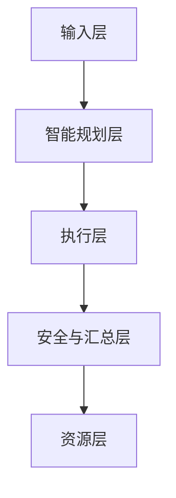

# 系统总体架构

## 分层架构

- 输入层：User/API：自然语言目标、约束、数据引用
- 智能规划层：Planner+KG：任务解析、KG约束推理、计划JSON
- 执行层：Executor+ToolAdapters：工具编排执行、I/O标准化
- 安全与汇总层：Safety+Summarizer：风险识别/阻断、报告生成/反馈
- 资源层：ProteinToolKG/Models/Storage：KG、模型、数据/日志/工作持久化



**目录映射**

- 输入层：CLI/脚本(`run_demo.py`)
- 智能规划层：`src/agents/planner.py` + `src/kg/protein_tool_kg.json`
- 执行层：`src/agents/executor.py` + `src/models/adapters/*`
- 安全与汇总层：`src/agents/safety.py`, `src/agents/summarizer.py`
- 资源层：`src/kg/`, `output/`, `data`, 模型、权重等

## 组件视图

### Interface & Core

- `TaskAPI`: 创建/执行任务；加载/保存计划与报告
- `Workflow`: 编排入口，驱动Planner->Executor->Safety->Summarizer
- `DataContract`: 统一任务与结果契约(`ProteinDesignTask`/`DesignResult`)

### Agents

- **PlannerAgent**: 解析任务与约束，基于KG产生计划JSON
- **ExecutorAgent**: 解析计划；按顺序加载ToolAdapter；写入中间产物与指标
- **SafetyAgent**: 对输入/过程/输出进行分级校验与阻断/告警
- **SummarizerAgent**: 汇总数据与元信息 -> `output/reports/*.json|md`

### ToolAdapters(适配器层)

- `ProteinMPNNAdapter`: 序列生成(结构引导/目标引导)
- `ESMFoldAdapter`: 序列->结构预测(输出`pdb_path`,`plddt`)
- `RDKitPropsAdapter`: 理化性质与二次分析(输出指标字典)

### Knowledge & Storage

- **ProteinToolKG**: 工具节点与兼容关系
- **Storage**: `output/`、`data/logs`、`data/inputs`


## 运行视图与时序图

端到端LLM调控闭环


**单步骤微循环**


## 数据流与控制流

**数据流**

- 输入契约：`ProteinDesignTask{task_id, goal, constraints{length_rande, organism, structure_template_pdb...`}}
- 计划契约：`Plan{task_id, steps[{id, tool, inputs{...}}], constraints{max_runtime_min, safety_level}}`
- 输出契约：`DesignResult{task_id, sequence, structure_pdb_path, scores{},risk_flags{}}`
- 中间产物：`output/pdb*.pdb`, `output/metrics/*.csv`, `data/logs/*.jsonl`

**控制流**

- Workflow驱动Agent顺序；Executor负责步骤级重试/失败终止；safety贯穿检查；summarizer终结输出。

## 计划契约(Plan JSON, Planner输出)

```json
{
  "task_id": "demo_001",
  "steps": [
    {"id":"S1","tool":"protein_mpnn","inputs:"{"goal":"thermostable enzyme","length_range":[80,150]}},
    {"id":"S2","tool":"esmfold","inputs":{"sequence":"S1.sequence"}},
    {"id":"S3","tool":"rdkit_props","inputs":{"sequence":"S1.sequence","pdb_path":"S2.pdb_path"}}
  ],
  "constraints":{"max_runtime_min":60,"safety_level":"S1"}
}
```

- 引用语义：`"Sx.key"`表示“取步骤Sx的输出字段key”
- 执行要求：Executor必须解析依赖、校验必须字段存在与类型正确
- 安全级别：`S0=严格限制`/`S1=默认安全`

## ProteinToolKG概要

**工具节点**

```json
{
  "id":"esmfold",
  "name":"ESMFold",
  "capability":["structure_prediction"],
  "io": { "inputs":{"sequence":"str"}, "outputs":{"pdb_path":"path","plddt":"float"} },
  "compat": {"from":["protein_mpnn.sequence"]},
  "cost":"medium",
  "safety_level":"S1",
  "version":"1.0.0"
}
```

**规划规则**

- R1 I/O匹配：前一步输出键名必须覆盖下一步`io.inputs`
- R2 安全匹配：`tool.safety_level <= plan.constraints.safety_level`
- R3 成本优先：同能力工具按照`cost`升序优先
