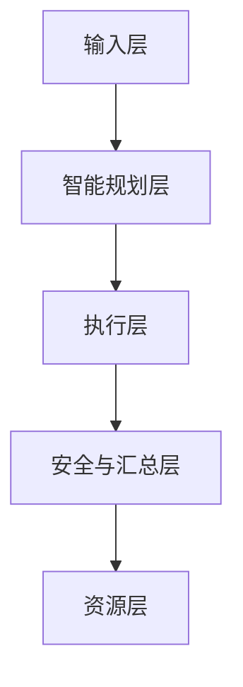
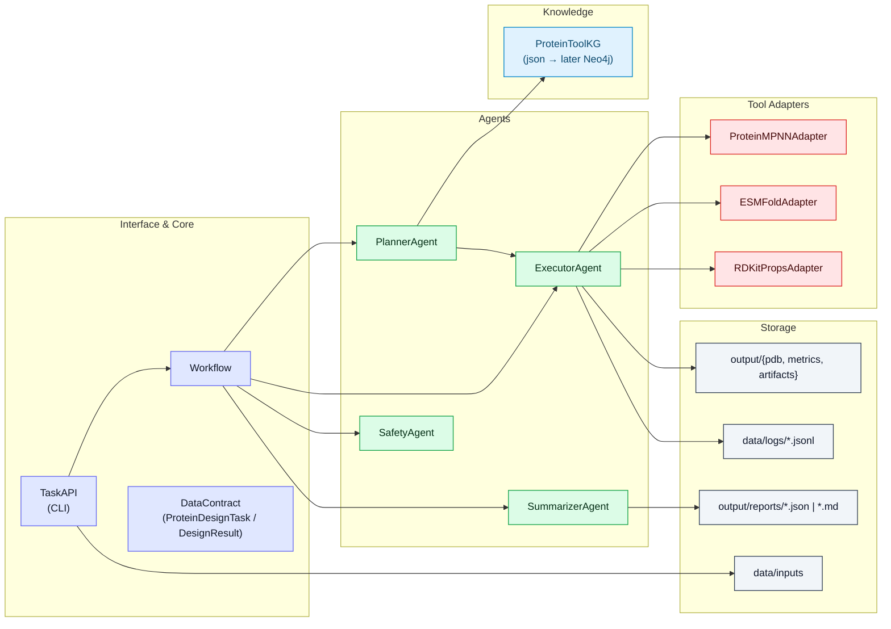
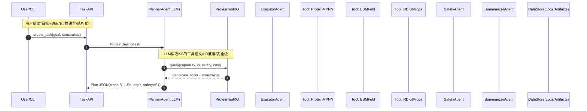

# 系统总体架构

## 分层架构

- 输入层：User/API：自然语言目标、约束、数据引用
- 智能规划层：Planner+KG：任务解析、KG约束推理、计划JSON
- 执行层：Executor+ToolAdapters：工具编排执行、I/O标准化
- 安全与汇总层：Safety+Summarizer：风险识别/阻断、报告生成/反馈
- 资源层：ProteinToolKG/Models/Storage：KG、模型、数据/日志/工作持久化

**目录映射**

- 输入层：CLI/脚本(`run_demo.py`)
- 智能规划层：`src/agents/planner.py` + `src/kg/protein_tool_kg.json`
- 执行层：`src/agents/executor.py` + `src/models/adapters/*`
- 安全与汇总层：`src/agents/safety.py`, `src/agents/summarizer.py`
- 资源层：`src/kg/`, `output/`, `data`, 模型、权重等

## 组件视图

### Interface & Core

- `TaskAPI`: 创建/执行任务；加载/保存计划与报告
- `Workflow`: 编排入口，驱动Planner->Executor->Safety->Summarizer
- `DataContract`: 统一任务与结果契约(`ProteinDesignTask`/`DesignResult`)

### Agents

- **PlannerAgent**: 解析任务与约束，基于KG产生计划JSON
- **ExecutorAgent**: 解析计划；按顺序加载ToolAdapter；写入中间产物与指标
- **SafetyAgent**: 对输入/过程/输出进行分级校验与阻断/告警
- **SummarizerAgent**: 汇总数据与元信息 -> `output/reports/*.json|md`

### ToolAdapters(适配器层)

- `ProteinMPNNAdapter`: 序列生成(结构引导/目标引导)
- `ESMFoldAdapter`: 序列->结构预测(输出`pdb_path`,`plddt`)
- `RDKitPropsAdapter`: 理化性质与二次分析(输出指标字典)

### Knowledge & Storage

- **ProteinToolKG**: 工具节点与兼容关系
- **Storage**: `output/`、`data/logs`、`data/inputs`

## 运行视图与时序图

端到端LLM调控闭环

