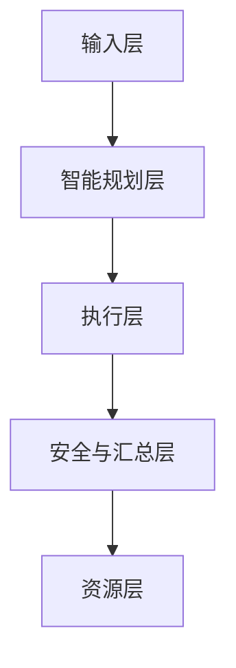
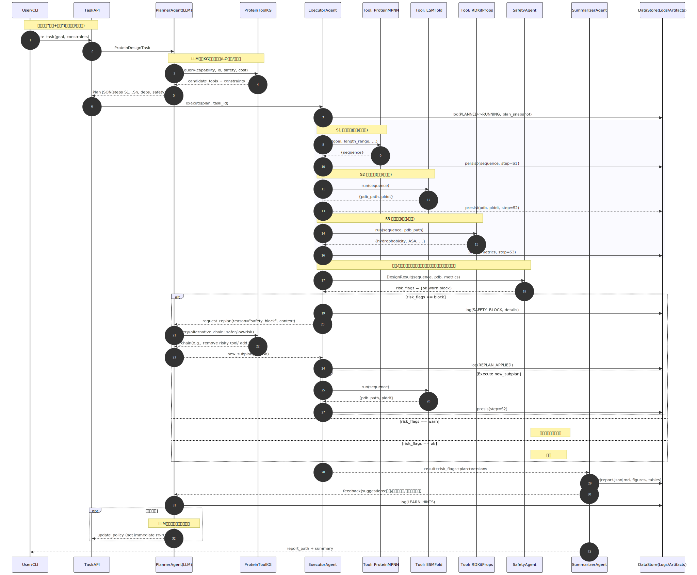
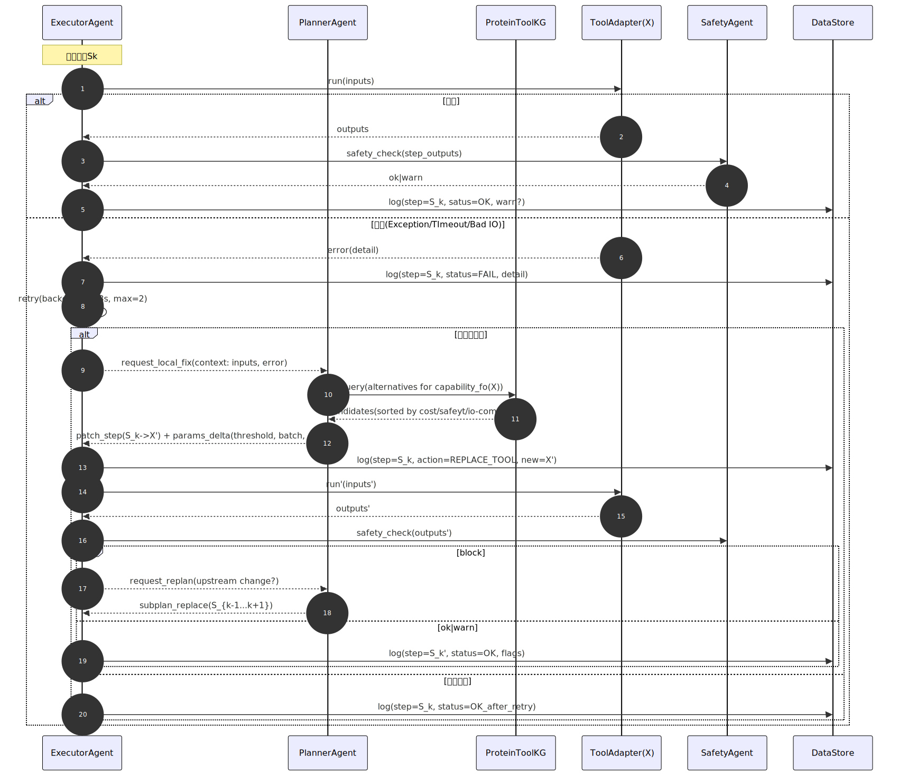

# 系统总体架构

## 分层架构
<!-- SID:arch.overview.layers -->

- 输入层：User/API：自然语言目标、约束、数据引用
- 智能规划层：Planner+KG：任务解析、KG约束推理、计划JSON
- 执行层：Executor+ToolAdapters：工具编排执行、I/O标准化
- 安全与汇总层：Safety+Summarizer：风险识别/阻断、报告生成/反馈
- 资源层：ProteinToolKG/Models/Storage：KG、模型、数据/日志/工作持久化



**目录映射**

- 输入层：CLI/脚本(`run_demo.py`)
- 智能规划层：`src/agents/planner.py` + `src/kg/protein_tool_kg.json`
- 执行层：`src/agents/executor.py` + `src/adapters/` + `src/tools/`
- 安全与汇总层：`src/agents/safety.py`, `src/agents/summarizer.py`
- 资源层：`src/kg/`, `output/`, `data`, 模型、权重等

## 组件视图
<!-- SID:arch.components.overview -->

### Interface & Core

- `TaskAPI`: 创建/执行任务；加载/保存计划与报告
- `Workflow`: 编排入口，驱动Planner->Executor->Safety->Summarizer
- `DataContract`: 统一任务与结果契约(`ProteinDesignTask`/`DesignResult`)

### Agents

- **PlannerAgent**: 解析任务与约束，基于KG产生计划JSON
- **ExecutorAgent**: 解析计划；按顺序加载ToolAdapter；写入中间产物与指标
- **SafetyAgent**: 对输入/过程/输出进行分级校验与阻断/告警
- **SummarizerAgent**: 汇总数据与元信息 -> `output/reports/*.json|md`

### ToolAdapters(适配器层)

适配器分为两层：

- **基础层(Adapter Infra)**：`src/adapters/`
  - `BaseToolAdapter` 抽象与 `AdapterRegistry`
  - 负责统一接口、注册/检索与执行入口规范
- **工具层(Concrete Tool)**：`src/tools/<tool>/adapter.py`
  - 面向具体工具的输入解析与执行封装
  - 工具 pipeline/脚本放在各自的 `src/tools/<tool>/` 下

Executor/StepRunner 只依赖基础层接口，不关心具体工具实现，从而保持执行层与工具实现解耦。

#### 执行后端边界(Nextflow)
<!-- SID:arch.execution.nextflow_boundary -->

- Nextflow 仅作为单步工具执行后端，单次 run 对应一个 PlanStep（blocking）。
- 控制流 SSOT 仍在 Workflow/FSM/PlanStep，Nextflow 不参与多步编排或决策。
- 失败传播：Nextflow 失败 → StepResult.failed → Executor retry/patch/replan → FSM 转移（不新增 FSM 状态或 Agent 角色）。
- 输出目录约定与资源层一致：产物根目录为 `output/`，Adapter 只解析工作目录并回填路径。

### Knowledge & Storage

- **ProteinToolKG**: 工具节点与兼容关系
- **Storage**: `output/`、`data/logs`、`data/inputs`

### 外部决策Agent / 人在环路设计

- `HumanDecision` 或 `Human Reviewer` ，作为外部决策Agent
- 通过 PendingAction / Decision API 与系统交互，而不是直接操纵内部FSM



## 运行视图与时序图
<!-- SID:arch.flow.end_to_end -->

端到端LLM调控闭环

角色包括：

- User/CLI：用户，只会给一段自然语言需求
- TaskAPI: 后端入口，负责把自然语言变成统一的任务对象、改任务状态、写数据库
- PlannerAgent(LLM): 大脑，负责读任务、查数据库，设计"怎么走这条流水线"的plan
- ProteinToolKG: 工具知识图谱，记录有哪些工具，能做什么，输入输出格式，安全/成本等
- ExecutorAgent: 执行者，按照Plan按步骤调用具体工具
- 具体工具：ProteinMPNN、ProtGPT2(PLM)、ESMFold、RDKitProps等
- SafetyAgent: 安全者，负责判断这些序列/结构/分子是不是危险的或是否超出约束
- SummarizerAgent: 写总结报告的，帮人类读懂JSON
- DataStore: 所有过程中的输入、输出、日志、Plan版本

---

### 总体流程

#### 1.任务进入+Planner制定初始Plan

1. 用户发起任务
2. TaskAPI做标准化的任务封装  
   它会做：
   - 分配一个task_id;
   - 把自然语言解析为一个结构化的 `ProteinDesignTask`对象
   - 把任务状态写成`CREATED`存进DataStore
3. PlannerAgent 取任务+查 ToolKG
   Planner拿到 `ProteinDesignTask`之后，会首先：
   - 查找ProteinToolKG: 根据需求寻找系统里有什么工具链可以支持
   - 从KG拿到信息：
     - 哪个工具负责生成序列(ProteinMPNN、ProtGPT2(PLM)、ESM-IF1等);
     - 哪个工具负责结构预测(ESMFold、AlpaFold3...);
     - 哪个工具负责性质估算(RDKitProps等)
     - 每个工具的输入/输出的Schema、运行成本、安全标签等
4. PlannerAgent生成与个Plan JSON
   在这些信息的基础上，Planner会输出一个Plan,比如:  
   - S1: 调用ProtGPT2(PLM)或ProteinMPNN, 输入[任务约束+template结构]，输出候选序列20条
   - S2: 调用ESMFold，对每条序列预测结构
   - S3: 调用RDKitProps, 计算稳定性/溶解度等指标
   - S4: 根据指标排序并列出top-K作为final推荐
   同时会把每一步输入/输出契约写进Plan中
5. TaskAPI更新任务状态 + 记录Plan
   Planner把Plan交还TaskAPI:  
   - TaskAPI把任务状态改为 `PLANNED`
   - 把这份 Plan 存到DataStore

---

#### 2. Executor按照Plan执行 + 写中间结果

6. ExecutorAgent领到Plan
   Executor从DataStore/TaskAPI读到这个任务和它的Plan:  
   - 把任务状态改为 `RUNNING`;
   - 把Plan版本/开始时间记录到日志
7. 执行S1: 序列生成工具
   - Executor调用 `ToolAdapter(ProtGPT2/ProteinMPNN)`, 把Plan定义的参数输入进去;
   - 工具跑完返回一批候选序列
   - Executor把这些序列写入DataStore
8. 执行S2: 结构预测工具
   - Executor把S1输出序列作为输入；
   - 调用ESMFold的适配器
   - 得到一批结构，继续写入DataStore有状态的消息流图
9. 执行S3: 性质评估
    - Executor取S2的输出
    - 调用RDKitProps或者其他评价工具
    - 得到稳定性评分等，写入DataStore
10. 聚合本次设计结果
    - Executor把各步结果聚合成一个`DesignResult`对象
      - 包含：候选序列列表、对应结构、各项评分、Plan版本、时间戳等
    - 存入DataStore,状态准备交给后面的安全与总结

---

#### 3. SafetyAgent安全检查+触发重规划

11. SafetyAgent做全局安全检查
    Safety从DataStore读出：  
    - 最终的`DesignResult`
    - 或者某些关键中间产物
    它按照所设定的安全规则做检查，比如：  
    - 序列是否含有非法字符或不符合约束
    - 与某些危险序列库相似度是否过高
    - 某些结构/功能是否踩到禁区
    然后得到一个风险标记：  
    - `ok`：没有问题
    - `warn`: 有风险但是可以接受
    - `block`：必须拒绝这批结果
12. 三种结果的分支，核心在`block`
    - 如果是`ok`: 记录安全日志即可，流程走向Summarizer
    - 如果是`warn`: 记录warning, 但允许继续
    - 如果是`block`: 触发重规划部分：
      - Safety记录一个 `SAFETY_BLOCK` 事件
      - 把风险原因、对应的序列、相关上下文打包发给 PlannerAgent
13. PlannerAgent基于安全反馈重写子计划
    Planner收到上下文之后，会进行一次"局部思考"
    - 问题出现的环节
    - 再去查一遍ProteinToolKG:
      - 有没有更安全的生成方式(比如换一个生成模型、加一个过滤工具、调整参数等)
      - 有没有现有工具可以作为安全过滤插入在原来的流水线中间
    它会产出一个新的子计划 `new_subplan`, 例如：  
    - 在S1之后插入一个"序列过滤step"
    - 或者把S1换成一个相对保守的工具
14. ExecutorAgent应用新子计划：  
    - Executor记录`REPLAN_APPLIED`
    - 把new_subplan中的相关步骤执行一遍
    - 然后再次交给SafetyAgent, 确认新结果是否安全

Safety Agent 内部采用规则插件化机制，将不同安全策略建模为独立的 SafetyRule，并在输入、
执行与输出三个阶段分别加载合适规则，对任务进行多层次安全治理（具体设计见系统实现
设计文档中的 SafetyAgent 部分）。

---

#### 4. Summarizer写报告

15. SummarizerAgent生成报告总结  
    Summarizer读DataStore:
    - 拿到最终`DesignResult`
    - 拿到Plan+其版本/重规划记录
    - 拿到SafetyAgent的风险报告
    其会生成：
    - 供阅读的Markdown报告
    - 对开发者/系统的经验总结
16. 写入DataStore, 返回用户
    - 报告路径、摘要信息写入DataStore;
    - TaskAPI把任务状态改成`FINISHED`;
    - CLI端收到一个简单的响应

---



---

### 单步骤微循环


---

参与者主要是：  

- ExecutorAgent: 控制这个单步
- ToolAdapter(X): 这一步用到的具体工具
- SafetyAgent: 这一步的输出是不是安全、有没有超出约束
- PlannerAgent + ProteinToolKG: 出现问题时，寻找替代方案
- DataStore: 记录这一小步的输入、输出、错误、重试次数等

---

#### 1. 正常路径: 调用成功+安全通过

1. Executor解析Plan:  
   - Plan中会写：$S_k$调用工具X, 输入是什么
   - Executor从DataStore把前面步骤的输出取出来，组合成这一步的输入
2. 调用ToolAdapter(X): 
   - 把输入丢给X;
   - 正常工具执行完毕，返回一个output
3. SafetyAgent检查该步输出： 
   - 查看这一步的输出是否存在需要拦截的问题
   - 标记为`ok`/`warn`/`block`
4. Executor把这一步的结果写DataStore
   - `step_id = k`
   - `status = SUCCESS`
   - 输出数据的引用
   - 安全结果
5. 控制权返回端到端流程
   - 下一步的$S_{k+1}$会以这个输出作为输入

#### 2. 工具报错：重试+标准异常处理

有两类问题：

1. 硬错误：超时、连接失败、工具崩溃、输入不合法导致程序失败
2. 软错误：返回不符合schema、NaN、大面积缺失等

图中体现为：

1. ToolAdapter(X)返回错误/异常对象
2. Executor记录`status=FAIL`，写入错误类型、错误信息到DataStore;
3. Executor看自己的重试策略：
   1. 比如最多重试三次，指数退避间隔
   2. 如果是临时错误优先重试
   3. 如果是输入不合法类错误，重试意义不大，可以直接跳转到局部修复
4. 如果重试成功，回到正常路径
5. 如果重试次数耗尽仍失败，进入下面的局部重试路径

---

#### 3. 局部修复：PlannerAgent协助更换工具

当ExecutorAgent发现某一步总是无法通过，或者每次运行结果总被SafetyAgent判block的结果

ExecutorAgent就会启动一个小对话：

1. ExecutorAgent->PlannerAgent: 请求局部修复：  
   请求里会包括：  
   - 当前任务和步骤编号
   - 原始Plan里对这个步骤的描述
   - 这一步的输入
   - 错误类型
   - 已经尝试过的工具/参数
2. PlannerAgent+ProteinToolKG做局部搜索：  
   - Planner这时做的事情类似于小规模搜索
   - 在ToolKG里找到同能力的其他工具
   - 或者找到可以对输入做预处理/过滤的辅助工具
   - 或者只是建议调节一些参数
   输出结果可能是：  
   - 换一个工具X；
   - 在X前/后插入一个Y作为预/后处理
3. ExecutorAgent应用新的局部Plan  
   - 如果只是换工具/调参数，但上下文不变，Executor直接在当前单步里就切换：
     - 记录一个`REPLACE_TOOL`或`PARAM_TWEAK`事件到DataStore
     - 用新配置再次执行S_K
   - 如果Planner判断这一步的变动会影响前后几步
     - 就会把一整段字串`S_k-1...S_k+1`用一个新的子计划替换
     - Executor需要重新跑这段子链
4. SafetyAgent再次审查
   - 执行完毕后，再进行一次Safety
   - 如果通过，则这一步视为"修复成功"

---


---   

## 任务生命周期与状态机(FSM)
<!-- SID:fsm.lifecycle.overview -->

为了支持 "人在环路"(Human-in-the-loop)、任务快照与可恢复执行，本系统将一次蛋白质设计任务抽象为一个有限自动机(Finite State Machine, FSM)。FSM 不仅表示执行进度，也编码了 "决策阶段" 与 "人工审查点"

### 状态列表
<!-- SID:fsm.states.definitions -->

在当前设计中，任务可能处于以下状态(部分为原有状态的语义精化)

|状态|含义|
|:---|:---|
|`CREATED`|任务已经创建，尚未开始规划|
|`PLANNING`|PlannerAgent 正在生成重新执行Plan|
|`WAITING_PLAN_CONFIRM`|初始 Plan 已经生成，等待人工确认工具链与关键参数 <!-- SID:fsm.states.waiting_plan_confirm -->|
|`PLANNED`|Plan 已经确认(自动或人工)，可进入执行阶段|
|`RUNNING`|ExecutorAgent 正在按照 Plan 执行步骤|
|`WAITING_PATCH_CONFIRM`|执行中发现局部失败，系统已经生成 Patch 候选，等待人工确认是否应用 <!-- SID:fsm.states.waiting_patch_confirm -->|
|`WAITING_REPLAN_CONFIRM`|执行中发现整体风险或目标转移，系统已生成 Replan 候选，等待人工确认是否应用 <!-- SID:fsm.states.waiting_replan_confirm -->|
|`SUMMARIZING`|执行完成: SummarizerAgent 正在生成结果汇总与报告|
|`DONE`|任务成功完成，所有结果已经生成|
|`FAILED`|任务失败，且无法自动或人工修复|
|`CANCELLED`|任务被人工显式停止|

其中,所有以 `WAITING_*` 命名的状态均表示:
**系统已暂停执行，正等待人类提交决策以继续或终止任务**

<!-- SID:fsm.transitions.overview BEGIN -->
**状态转换规则**:
- `CREATED` → `PLANNING` → `WAITING_PLAN_CONFIRM` → `PLANNED` → `RUNNING`
- `RUNNING` → `WAITING_PATCH_CONFIRM` (局部失败) 或 `WAITING_REPLAN_CONFIRM` (安全阻断)
- `WAITING_*` → `RUNNING` (决策批准) 或 `FAILED`/`CANCELLED` (决策拒绝)
- `RUNNING` → `SUMMARIZING` → `DONE`
<!-- SID:fsm.transitions.overview END -->

### 人在环路与 PendingAction 的关系
<!-- SID:arch.contracts.pending_action BEGIN -->

为了统一建模 "等待人工输入" 这一行为，系统在进入任意 `WAITING_*` 状态时都会生成一个结构化的 `PendingAction` 对象，例如:

- `WAITING_PLAN_CONFIRM` → `PendingAction{ action_type="plan_confirm", candidates=[Plan...], ...}`
- `WAITING_PATCH_CONFIRM` → `PendingAction{ action_type="patch_confirm", candidate_patch=PlanPatch, ...}`
- `WAITING_REPLAN_CONFIRM` → `PendingAction{ action_type="replan_confirm", candidates=[Replan...], ...}`

此时:

- FSM 的状态固定在对应的`WAITING_*`
- API层可以通过 `GET /pend-actions` 或 `Get /tasks/{id}` 暴露当前待决策信息
- 外部UI或CLI将候选方案展示给科研人员
- 人类提交 `Decision` 后: <!-- SID:arch.contracts.decision BEGIN -->
  - 系统能够根据 `Decision` 内容更新 Plan/PlanPatch/Replan
  - 记录事件日志
  - 触发一次状态转移
<!-- SID:arch.contracts.decision END -->
<!-- SID:arch.contracts.pending_action END -->

### 快照与可恢复执行的约束
<!-- SID:arch.contracts.task_snapshot BEGIN -->

为了支持长时间运行与系统重启后的可靠恢复，FSM 对持久化有明确约束:

1. 状态变更即写入快照与日志事件
  - 每次状态变更都会:
    - 更新 Task 的当前状态(例如 `PLNNING → WAITING_PLAN_CONFIRM`)
    - 追加一条事件 (EventLog): 包含时间、前后状态、触发者、关键元数据
    - 在关键节点(生成新 Plan / 应用 Patch / 进入 `WAITING_*`)写入 `TaskSnapshot`:
      - 当前 Plan / PlanPatch / Replan 版本
      - 已完成步骤索引
      - 相关 artifacts 路径
      - 当前 `PendingActin`(若有)
2. 进入 `WAITING_*` 前必须完成快照
  - 只有在已经持久化完 Plan、执行进度与 PendingAction 之后，才允许将状态切换为 `WAITING_*`
  - 这样即便系统进程在等待期间崩溃或重启，任务也可以从快照中恢复到完整的 "等待决策" 场景
3. 从快照恢复执行
  - 当系统重启或任务被显式 "恢复执行" 时:
    - 根据 Task 当前状态和最新 `TaskSnapshot` 恢复上下文
    - 若处于 `WAITING_*`, 则继续等到 Decision, 不会自动推进
    - 若处于 `RUNNING`, 则从快照记录的步骤索引继续调度 Executor/ExecutionBackend
<!-- SID:arch.contracts.task_snapshot END -->

## 数据流与控制流
<!-- SID:arch.dataflow.overview -->

**数据流**

- 输入契约：`ProteinDesignTask{task_id, goal, constraints{length_rande, organism, structure_template_pdb...`}}
- 计划契约：`Plan{task_id, steps[{id, tool, inputs{...}}], constraints{max_runtime_min, safety_level}}`
- 输出契约：`DesignResult{task_id, sequence, structure_pdb_path, scores{},risk_flags{}}`
- 中间产物：`output/pdb*.pdb`, `output/metrics/*.csv`, `data/logs/*.jsonl`

**控制流**

- Workflow驱动Agent顺序；Executor负责步骤级重试/失败终止；safety贯穿检查；summarizer终结输出。

## 计划契约(Plan JSON, Planner输出)
<!-- SID:arch.contracts.plan -->

```json
{
  "task_id": "demo_001",
  "steps": [
    {"id":"S1","tool":"protein_mpnn","inputs":{"goal":"thermostable enzyme","length_range":[80,150]}},
    {"id":"S2","tool":"esmfold","inputs":{"sequence":"S1.sequence"}},
    {"id":"S3","tool":"rdkit_props","inputs":{"sequence":"S1.sequence","pdb_path":"S2.pdb_path"}}
  ],
  "constraints":{"max_runtime_min":60,"safety_level":"S1"}
}
```

- 引用语义：`"Sx.key"`表示“取步骤Sx的输出字段key”
- 执行要求：Executor必须解析依赖、校验必须字段存在与类型正确
- 安全级别：`S0=严格限制`/`S1=默认安全`

## ProteinToolKG概要
<!-- SID:arch.kg.overview -->

**工具节点**

```json
{
  "id":"esmfold",
  "name":"ESMFold",
  "capability":["structure_prediction"],
  "io": { "inputs":{"sequence":"str"}, "outputs":{"pdb_path":"path","plddt":"float"} },
  "compat": {"from":["protein_mpnn.sequence"]},
  "cost":"medium",
  "safety_level":"S1",
  "version":"1.0.0"
}
```

**规划规则**

- R1 I/O匹配：前一步输出键名必须覆盖下一步`io.inputs`
- R2 安全匹配：`tool.safety_level <= plan.constraints.safety_level`
- R3 成本优先：同能力工具按照`cost`升序优先
