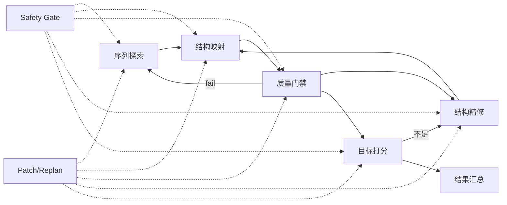

# De Novo Workflow：分层与模块化设计

## 范围与定位
<!-- SID:workflow.overview.scope -->

本文档定义 de novo 蛋白质设计的**六阶段分层**与**模块化组合规则**，用于指导 Planner/Executor/Safety 在实际执行时
形成可组合、可替换、可重规划的能力链路。该设计不构成单一流水线，强调**循环与控制层贯穿**。

本规范与系统分层架构相互独立，系统层分层见 [ref:SID:arch.overview.layers]。

## 设计目标与约束
<!-- SID:workflow.design.goals -->

- **可组合**：每一阶段都以能力模块定义，Planner 可按 I/O 契约自由拼接。
- **可替换**：同一阶段允许多个工具实现，支持 Patch 级别替换。
- **可重规划**：全局风险、目标偏离或多次失败时触发 Replan。
- **非单一流水线**：允许局部回环与多次迭代，不强制直线型执行。
- **职责边界清晰**：Executor 负责计算与评估，Safety 负责风险门禁与阻断。

## 六阶段分层
<!-- SID:workflow.layers.six_stage -->

六阶段仅定义能力分层，不绑定具体工具。工具选择与替换由 Planner + ToolKG 完成
（参考 [ref:SID:planner.algorithm.tool_retrieval] 与 [ref:SID:tools.executor.overview]）。

### 1) 序列探索（Sequence Exploration）
<!-- SID:workflow.stage.sequence_exploration -->

- **目标**：生成多样化候选序列集合，覆盖目标空间。
- **典型输入**：设计目标、长度范围、模板片段或提示片段。
- **典型输出**：候选序列列表 + 初步评分/置信度。
- **示例工具**：ProtGPT2（见 [ref:SID:tools.protgpt2.spec]）。
- **循环关系**：与质量门禁形成“生成 → 过滤 → 再生成”的闭环。

### 2) 结构映射（Structure Projection）
<!-- SID:workflow.stage.structure_projection -->

- **目标**：将候选序列映射为结构，并提供结构置信度。
- **典型输入**：单条序列。
- **典型输出**：结构文件、pLDDT/置信度指标。
- **示例工具**：ESMFold（见 [ref:SID:tools.esmfold.spec]）。
- **循环关系**：与精修/质量门禁形成结构质量回环。

### 3) 结构与序列质量门禁（Quality Gate）
<!-- SID:workflow.stage.quality_gate -->

- **目标**：执行硬性可行性与质量过滤（长度、合法字符、结构完整性、低复杂度等）。
- **典型输入**：序列、结构与中间指标。
- **典型输出**：合格标记、剔除原因、可复用的 QC 指标。
- **执行边界**：由 Executor 运行评估工具；Safety 不直接执行工具，仅做风险判定。

### 4) 结构条件下的序列精修（Structure-conditioned Refinement）
<!-- SID:workflow.stage.structure_refinement -->

- **目标**：在结构约束下优化序列，提高稳定性或满足局部约束。
- **典型输入**：结构模板/骨架、目标约束。
- **典型输出**：精修后的序列集合与改进指标。
- **示例工具**：ProteinMPNN（参考工具目录）。
- **循环关系**：与结构映射、质量门禁形成“精修 → 结构预测 → 质量校验”的闭环。

### 5) 目标/功能/物性评估（Objective Scoring）
<!-- SID:workflow.stage.objective_scoring -->

- **目标**：多目标评分与排序（功能、物性、稳定性、成本等）。
- **典型输入**：通过质量门禁的候选序列/结构。
- **典型输出**：打分结果、Top‑K 列表。
- **说明**：与质量门禁分离，前者是“硬门禁”，本阶段是“优化打分”
  （候选评分原则见 [ref:SID:planner.algorithm.candidate_scoring]）。

### 6) Patch/Replan 控制层（Control Layer）
<!-- SID:workflow.stage.patch_replan_control -->

- **目标**：对失败、风险或偏离目标的流程进行修补或重规划。
- **触发来源**：执行失败、Safety block/warn、目标未达标、多轮迭代耗尽。
- **控制语义**：不是线性步骤，而是贯穿式控制层，可在任一阶段介入。
- **候选生成**：遵循 Patch/Replan 规则（参见 [ref:SID:planner.contracts.patch_candidate]）。

## 模块化接口与可替换原则
<!-- SID:workflow.modules.interface -->

为保证可组合与可替换，每个阶段需维持**最小 I/O 契约**：

| 阶段 | 能力标签（示意） | 输入关键字段 | 输出关键字段 |
| --- | --- | --- | --- |
| 序列探索 | `sequence_generation` | goal, length_range | candidates, sequence |
| 结构映射 | `structure_prediction` | sequence | pdb_path, confidence |
| 质量门禁 | `quality_qc` | sequence, pdb_path | qc_flags, qc_metrics |
| 结构精修 | `structure_conditioned_design` | pdb_path, constraints | candidates, sequence |
| 目标打分 | `objective_scoring` | candidates, metrics | score_table, top_k |

工具替换必须满足：
1. **输入输出闭包**：新工具的输入能从已完成步骤解析。
2. **风险与成本可比较**：可用于 Planner 的候选评分与选择。
3. **结果可追溯**：输出结构需可被 StepResult 记录（见 [ref:SID:agent.contracts.step_result]）。

## 可循环步骤与贯穿步骤
<!-- SID:workflow.loops.and_crosscut -->

**可循环步骤（典型）**：
- 序列探索 ↔ 结构映射 ↔ 质量门禁（探索‑过滤闭环）
- 结构精修 ↔ 结构映射 ↔ 质量门禁（结构条件优化闭环）
- 目标打分 → 结构精修 / 序列探索（目标未达标时回退）

**贯穿步骤（跨层控制）**：
- Safety 输入/步骤/输出检查，必要时触发重规划（见 [ref:SID:safety.responsibilities.must]）。
- Patch/Replan 控制层：可插入/替换/重排步骤，不依赖固定位置。

## 分工映射（Planner/Executor/Safety）
<!-- SID:workflow.integration.responsibilities -->

- **Planner**：根据 ToolKG 组装候选链路、排序并输出 Plan（见 [ref:SID:planner.algorithm.tool_retrieval]）。
- **Executor**：执行各阶段工具并输出 StepResult/DesignResult（见 [ref:SID:agent.contracts.design_result]）。
- **Safety**：对输入/步骤/输出做风险判定并触发 Replan（见 [ref:SID:safety.responsibilities.must]）。
- **Summarizer**：汇总结果与决策轨迹，不影响执行流。

## 示例流程模板（非线性）
<!-- SID:workflow.examples.template -->

1. 序列探索生成候选序列集。
2. 结构映射预测结构并输出置信度。
3. 质量门禁过滤；失败则回到序列探索。
4. 目标打分不足时，回到结构精修再迭代。
5. 若 Safety block，触发 Patch/Replan；成功后重新进入目标打分。
6. 通过门禁与目标打分后，汇总输出结果。
