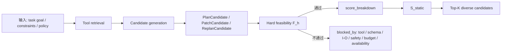
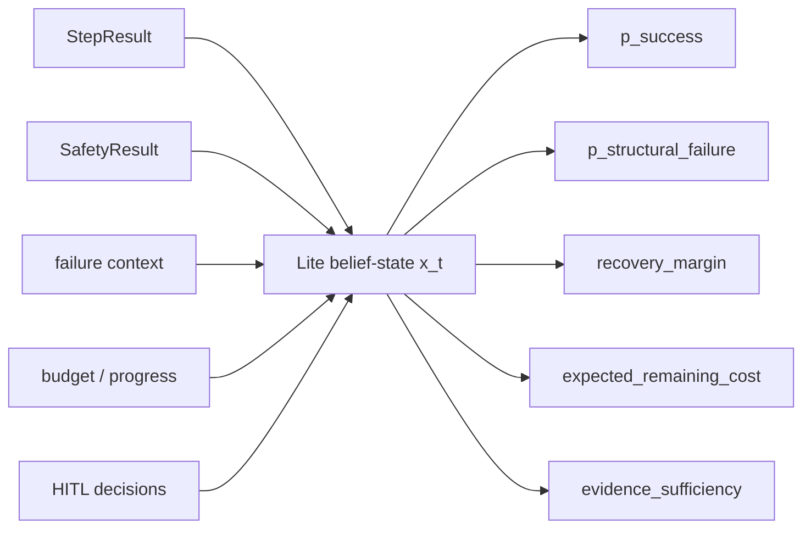
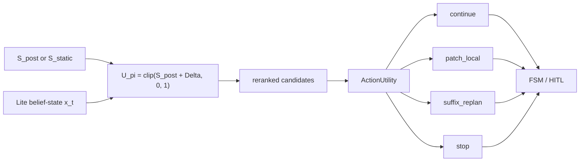
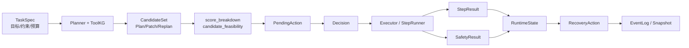

```mermaid
flowchart LR
  A["Task / Constraints / ToolKG"] --> B["静态规划层"]
  B --> C["Top-K Plan / Patch / Replan Candidates"]
  C --> D["硬可行性过滤"]
  D --> E["静态评分 S_static"]
  E --> F["执行与观测"]
  F --> G["Lite belief-state x_t"]
  G --> H["运行时重排 U_pi"]
  H --> I["Action Utility U_a"]
  I --> J["continue / patch_local / suffix_replan / stop"]
  J --> K["FSM / HITL / EventLog / Snapshot"]
```

# 答辩 PPT 算法贡献导向修改稿

版本：2026-05-25  
用途：本稿用于后续修改 `2022112879-郑彦文-毕业设计答辩.pptx` 与重写 `report.md`。当前文件只给出修改方案和可直接迁移的页面文案，不直接修改 PPT。

## 1. 修改目标

本轮修改的目标是把答辩重心从“系统全景展示”调整为“算法层面的贡献阐释”。

当前 PPT 的系统架构已经较完整，但正式答辩时间只有 8-10 分钟。如果继续铺陈五层架构、多 Agent、运行时时序和接口证据，容易让老师记住“做了一个多 Agent 系统”，却没有充分听清楚 CEBRA-WP 的算法贡献。新的主线应当让老师明确：

- CEBRA-WP 到底解决什么运行时决策问题；
- 算法输入什么、过滤什么、更新什么、输出什么；
- 静态评分与运行时自适应分别来自哪里；
- 这些评分、状态和动作如何影响系统决策；
- 难点在哪里，本文用什么工程机制把算法落地。

一句话定位：

> CEBRA-WP 是面向高代价蛋白质设计工作流的约束化、证据感知、轻量状态引导、恢复自适应规划机制；它先用硬约束保证候选可执行，再用静态评分建立先验排序，最后用运行时状态对合法候选和恢复动作进行有界调整。

## 2. 总体修改原则

### 2.1 PPT 原则

- 正式汇报建议从 16 页压缩到 13 页左右，备份页压缩到 4 页左右，最后保留 HIT 结束页。
- 架构页保留 2 页即可，作用是支撑算法落地，不再展开所有运行时细节。
- 正式汇报的核心页改为算法页：静态规划层、运行时自适应层、动作选择和工程落地。
- 运行时时序图不再作为正式汇报重点；如保留，建议放入备份页。
- 第 7 页右下角 ProteinToolKG 小图不保留在正式页。若需要展示，应放到备份页并放大，用于回答 ToolKG 如何约束工具链。
- 工作量不需要单独写“独自完成”，而是通过算法难点、实现映射、测试和 84-run 结果自然体现。
- PPT 上不显式写“上一页 / 下一页”的关系；通过页面内容顺序自然承接：问题约束 -> 系统支撑 -> 算法机制 -> 实现落点 -> 验证边界。

### 2.2 讲稿原则

`report.md` 后续应从“逐页铺陈”改为“问题主导”。每页只回答一个问题，避免第 3 页、第 5 页、第 9 页反复说同一组边界。

建议讲稿结构：

- 本页回答什么问题；
- 屏幕上看哪一块；
- 只讲一句主结论；
- 被追问时补充哪一层实现；
- 哪些内容不要在本页重复。

## 3. 压缩后的正式页结构

建议将正式汇报压缩为 13 页，备份页压缩为 4 页，最后保留 1 页结束页。这样总页数约 18 页，比当前 22 页更适合 8-10 分钟答辩。正式页不再把目录、问题链、研究边界、本人工作分别铺开，而是合并为连续叙事。

| 页码 | 建议标题 | 页面任务 | 建议时间 |
|---:|---|---|---:|
| 1 | 封面 | 建立题目和答辩人信息 | 15 秒 |
| 2 | 汇报结构与核心问题 | 合并目录和问题链，直接引出算法贡献 | 35 秒 |
| 3 | 为什么需要工作流规划机制 | 合并背景痛点和研究边界 | 55 秒 |
| 4 | 系统架构如何支撑算法落地 | 用一张架构图说明 CEBRA-WP 所在层次 | 50 秒 |
| 5 | 算法接口链：模块传递什么 | 说明算法依赖哪些结构化对象，而非完整时序 | 50 秒 |
| 6 | FSM/HITL：恢复动作如何被约束 | 说明算法输出不直接越权执行 | 45 秒 |
| 7 | CEBRA-WP 总览：静态规划 + 运行时自适应 | 建立算法全貌 | 55 秒 |
| 8 | 静态规划：候选、硬过滤与静态评分 | 合并候选生成、硬可行性过滤和 `S_static` | 75 秒 |
| 9 | 运行时状态：Lite belief-state 如何更新 | 讲清观测来源、五个状态变量、更新机制 | 65 秒 |
| 10 | 动态决策：重排候选并选择恢复动作 | 讲清 `U_pi`、`Delta`、`ActionUtility` 和四类动作 | 75 秒 |
| 11 | 算法如何落到实现 | 字段、模块与日志快照的实现映射 | 55 秒 |
| 12 | 验证：系统测试 + 84-run 消融 | 合并工程验证和算法验证证据 | 75 秒 |
| 13 | 贡献、局限与结论边界 | 收束算法贡献和不过度夸大 | 40 秒 |

核心变化：

- 原目录页和问题链页合并为 1 页，减少重复的“本文回答五个问题”表述。
- 原背景页和研究边界页合并为 1 页，边界只讲一次。
- 原 Agent 职责页改为“算法接口链”，保留结构化对象，不再逐个解释 Agent。
- 原运行时时序页下沉到备份页，正式页用 FSM/HITL 说明动作受控即可。
- 原“静态过滤”和“静态评分”合并为 1 页，作为静态规划层连续讲完。
- 原系统测试和 84-run 实验合并为 1 页，验证页只保留最关键数字。

### 3.1 备份页压缩建议

| 备份页 | 建议标题 | 用途 |
|---:|---|---|
| B1 | 公式与字段映射 | 回答静态评分、runtime adjustment、action utility 的细节 |
| B2 | ProteinToolKG 局部图 | 回答 ToolKG 如何提供 tool/schema/I-O/cost/safety 约束 |
| B3 | 失败样本与恢复边界 | 回答 3 个 FAILED run 说明什么 |
| B4 | 测试证据索引 | 回答 API、pytest、截图、EventLog/Snapshot 证据在哪里 |

后续工作不单独占正式页，可放在结论页一行或问答口头补充。

## 4. 压缩后的核心页修改稿

### 第 7 页：CEBRA-WP 总览

页面标题：

> CEBRA-WP：静态规划层 + 运行时自适应层

页面主结论：

> CEBRA-WP 不是一次性生成工具链，而是在“候选生成 -> 静态过滤评分 -> 运行时状态更新 -> 恢复动作选择”之间形成闭环。

建议图示：



页面文案：

- 静态规划层回答：哪些候选链路可执行，先验上更值得尝试。
- 运行时自适应层回答：已经执行到当前状态后，是否继续、局部修补、后缀重规划或止损。
- 两层之间通过结构化候选、步骤结果、安全结果、运行时状态和恢复动作连接。

口播稿：

CEBRA-WP 可以分成两层。第一层是静态规划层，它在执行前根据任务目标、约束和工具知识图谱生成候选链路，先做硬可行性过滤，再给候选打静态分。第二层是运行时自适应层，它在执行过程中读取 StepResult、安全事件、失败历史和预算信息，更新 Lite belief-state，并对合法候选和恢复动作做有界调整。这样系统不是一次性相信某条 LLM 生成的计划，而是在执行中持续判断这条链是否还值得继续。

### 第 8 页：静态规划层

页面标题：

> 静态规划：候选、硬过滤与静态评分

页面主结论：

> 静态规划层先保证候选可执行，再用多目标静态评分建立先验排序。

建议图示：



页面文案：

- 输入来源：任务目标、约束、预算、允许/禁用工具、ToolKG 快照。
- 候选类型：`PlanCandidate`、`PatchCandidate`、`ReplanCandidate`。
- 硬过滤项：tool 存在、schema 合法、I/O 闭合、safety 允许、budget-hard 未突破、关键工具可用。
- 静态评分项：可行性、目标匹配、成本、风险、恢复复杂度、工程可靠性。
- 输出：`candidate_feasibility`、`score_breakdown.overall / static_score`、Top-K 候选。

推荐页面公式：

```text
S_static = f(feasibility, objective, cost, risk, recovery_complexity, reliability)
```

口播稿：

静态规划层先回答“哪些候选能执行”，再回答“哪条链先验上更值得尝试”。LLM 或模板生成的工具链可能存在工具不存在、schema 错误、I/O 不闭合、安全不允许或预算越界等问题，所以 CEBRA-WP 先做硬可行性过滤。通过硬过滤后，系统再根据目标匹配、成本、风险、恢复复杂度和工具可靠性形成 `S_static`。这样可以避免把不可执行候选带入运行时重排，也避免一次性押注在单条链路上。

难点与解决：

| 难点 | 解决措施 |
|---|---|
| LLM 生成的候选可能格式正确但执行不闭合 | 用 ToolKG、schema 和 I/O closure 做确定性校验 |
| 工具可用性会随环境变化 | readiness / availability 纳入硬过滤与降级说明 |
| 安全和预算不能被评分项抵消 | safety、budget-hard 作为先验阻断条件 |

不要在正式页放完整加权公式。公式细节放 B1 备份页。

### 第 9 页：运行时状态更新

页面标题：

> Lite belief-state：把稀疏观测压缩成可解释状态

页面主结论：

> 运行时信息不是直接改计划，而是先更新五维轻量状态，再影响候选重排和动作选择。

建议图示：



页面文案：

- 观测来源：`StepResult.outputs / metrics / error_details`、`SafetyResult.risk_flags / action`、patch/replan 历史、预算与进度、HITL 决策记录。
- 状态变量：
  - `p_success`：当前链路最终完成的代理概率；
  - `p_structural_failure`：结构性失败压力；
  - `recovery_margin`：保留前缀继续恢复的余量；
  - `expected_remaining_cost`：预期剩余成本；
  - `evidence_sufficiency`：证据是否足以支撑进入高代价步骤。
- 更新机制：确定性规则表；成功提高成功概率和恢复余量，失败提高结构失败压力和剩余成本，安全 block 是强负证据。

口播稿：

运行时阶段的难点是观测不完整。一次工具失败并不能直接说明整条路线都错了，一次成功也不能说明后续一定可靠。因此我没有把运行时事件直接变成动作，而是维护一个轻量状态。这个状态不是完整 POMDP，只是工程化的 deterministic belief surrogate。它的好处是可解释、可序列化、可进入快照，并且能在实验中观察到。

讲解边界：

- 可以说：受 belief-state planning 启发，维护低维、确定性的状态代理。
- 不要说：学习到了最优 POMDP policy 或严格 Bayesian posterior。

### 第 10 页：动态重排与动作选择

页面标题：

> 动态决策：运行时只调整合法候选

页面主结论：

> 运行时状态通过有界修正影响候选排序，并通过动作效用选择 continue、patch_local、suffix_replan 或 stop。

建议图示：



页面文案：

- 候选效用：`U_pi = clip(S_post + Delta, 0, 1)`。
- `Delta` 是运行时有界修正，范围受限，不能覆盖硬约束。
- 动作选择：
  - `continue`：成功概率和证据充分度尚可；
  - `patch_local`：问题局部化，恢复余量足；
  - `suffix_replan`：结构性失败压力高，当前后缀不可靠；
  - `stop`：成功概率低、预算压力高、恢复余量低，且需要受保护进入 HITL。
- 输出不是直接执行，而是形成 PendingAction / Decision / EventLog / Snapshot。

口播稿：

动态阶段有两个输出。第一个是候选重排：静态分或后验目标分作为基础，运行时状态只做有界修正。这个修正不会改变硬过滤结果，也不会让 schema、I/O、安全违规的候选重新进入执行。第二个是恢复动作选择。系统在 continue、patch_local、suffix_replan 和 stop 之间计算动作效用。stop 尤其需要保护，它在实现中作为 terminal_stop 类型的重规划候选进入 HITL，而不是让算法悄悄终止任务。

难点与解决：

| 难点 | 解决措施 |
|---|---|
| 运行时信号可能过拟合单次失败 | `Delta` 有界，只修正排序 |
| 高代价调用不能盲目重跑 | 使用 budget pressure 与 evidence_sufficiency 抑制无效高代价调用 |
| stop 风险高 | `terminal_stop` 走 replan_confirm / HITL |
| 动作要可解释 | `ActionUtility` 保留 factors、features、source_refs |

## 5. 第 5 页“模块之间消息传递”建议

用户当前不确定“模块之间消息传递应该体现到哪一步”。建议不要做完整运行时时序图，而是做一张算法接口链，讲到 CEBRA-WP 需要的结构化对象即可。

页面标题：

> 算法接口链：模块之间传递什么

页面主结论：

> 系统不是让 Agent 直接互相传自然语言，而是把算法所需信息收束成结构化对象。

建议图示：



本页只讲三层信息：

1. 规划侧传出候选：`PlanCandidate / PatchCandidate / ReplanCandidate`，带 `structured_payload`、`score_breakdown`、`candidate_feasibility`。
2. 执行侧传回观测：`StepResult / SafetyResult / failure_context`，用于更新 `RuntimeState`。
3. 决策侧留下证据：`PendingAction / Decision / EventLog / Snapshot`，用于审计和恢复。

不要展开：

- 不展开每个 API endpoint；
- 不展开完整函数调用时序；
- 不展开前端页面细节；
- 不把 ToolAdapter 具体工具列表放在正式页。

口播稿：

模块之间信息传递可以理解为算法接口链。Planner 不把自然语言计划直接交给 Executor，而是输出结构化候选；候选先经过可行性和静态评分；人工确认后 Executor 才执行；执行结果以 StepResult 和 SafetyResult 回流，更新 RuntimeState；RuntimeEvaluator 再输出恢复动作。EventLog 和 Snapshot 贯穿全过程，保证每一步都可追溯。

## 6. 第 11 页“算法落地到实现”建议

页面标题：

> 算法对象如何落到代码

页面主结论：

> CEBRA-WP 的每个理论对象都有对应实现字段和模块，算法不是停留在概念图中。

建议内容表：

| 算法对象 | 实现字段 / 模块 | 作用 |
|---|---|---|
| 硬可行性过滤 `F_h` | `candidate_feasibility` / candidate generator | 阻断 tool、schema、I/O、safety、budget 违规候选 |
| 静态评分 `S_static` | `score_breakdown.overall` / `static_score` | 建立执行前候选排序 |
| 后验目标 `G_post` | `posterior_objective` | 用计算证据更新目标匹配项 |
| Lite belief-state `x_t` | `RuntimeState` / `belief_state.py` | 保存运行时五维状态 |
| 运行时修正 `Delta` | `runtime_adjustment` / `RuntimeEvaluator` | 对合法候选做有界重排 |
| 动作效用 `U_a` | `ActionUtility` | 选择 continue / patch / replan / stop |
| 审计与恢复 | `PendingAction` / `Decision` / `EventLog` / `Snapshot` | 保证动作可确认、可追溯、可恢复 |

口播稿：

这一页用来证明算法已经工程落地。比如硬可行性过滤在候选生成器中落为 candidate_feasibility，静态评分落为 score_breakdown，运行时状态落为 RuntimeState，动作选择落为 RuntimeEvaluator 和 ActionUtility。最后这些动作都不会直接绕过系统，而是通过 PendingAction、Decision、EventLog 和 Snapshot 进入可审计流程。

## 7. 需要从当前版本中压缩或下沉的内容

建议压缩：

- 当前第 6-8 页架构部分可保留，但时间控制在 2 分钟以内。
- 当前第 12-13 页工程实现可合并为一页，以算法对象到实现模块的映射为主。
- 当前第 20 页系统界面证据保留备份，不放正式部分。

建议下沉到备份：

- 运行时时序图；
- ProteinToolKG 局部可视化大图；
- 失败样本详细时间线；
- 公式细节和更新规则表；
- API / CLI / Web 证据索引。

建议删除或替换：

- 第 7 页右下角过小的 ProteinToolKG 缩略图：正式页无法读清，建议删除。
- 重复讲“本文不训练新模型、不做湿实验”的段落：保留在第 5 页和结论页即可，不要每页重复。

## 8. `report.md` 后续改写建议

`report.md` 不建议再按每页长段铺陈。建议改成“问题 -> 本页回答 -> 口播主句 -> 追问补充”的形式。

示例：

### 第 8 页：静态规划层

- 回答的问题：执行前如何保证候选工具链可执行？
- 口播主句：CEBRA-WP 先做硬可行性过滤，非法候选不进入评分和执行。
- 屏幕重点：看 `tool / schema / I-O / safety / budget / availability` 六个过滤项。
- 追问补充：硬过滤结果写入 `candidate_feasibility.blocked_by`，用于解释候选为什么不能执行。
- 不要重复：不要再次展开“本文不训练底层模型”。

### 第 9 页：运行时状态

- 回答的问题：执行中的失败、风险和成本信息如何被算法使用？
- 口播主句：系统把稀疏观测压缩成五维 Lite belief-state，再用于重排和动作选择。
- 屏幕重点：五个变量和五类观测来源。
- 追问补充：当前实现使用确定性更新规则表，便于测试、回放和写入 Snapshot。
- 不要重复：不要讲完整 POMDP，也不要把它说成学习型策略。

## 9. 最终答辩记忆点

建议答辩时让老师记住四句话：

1. CEBRA-WP 的贡献在运行时工作流规划，不在底层蛋白质生成。
2. 静态规划层先用 ToolKG、schema、I/O、安全和预算过滤不可执行候选，再用多目标静态评分建立先验排序。
3. 运行时自适应层用 StepResult、SafetyResult、失败历史和预算进度更新 Lite belief-state，只对合法候选做有界重排。
4. 算法输出 continue、patch_local、suffix_replan、stop 四类动作，并通过 FSM/HITL、EventLog 和 Snapshot 进入可审计流程。

## 10. 结论边界

正式答辩中建议保持以下表述：

- 可以说：系统验证了 CEBRA-WP 的规划、过滤、运行时状态更新、恢复动作选择和审计机制。
- 可以说：lite 组 21/21 runs 产生 RuntimeState，说明运行时状态可观测。
- 可以说：dynamic/lite 相比 fixed 减少高代价调用，说明动态机制在成本控制上有证据。
- 不应说：CEBRA-WP 显著提升了成功率。
- 不应说：posterior objective 等价于湿实验真值。
- 不应说：Lite belief-state 是完整 POMDP 或学习到的最优策略。
